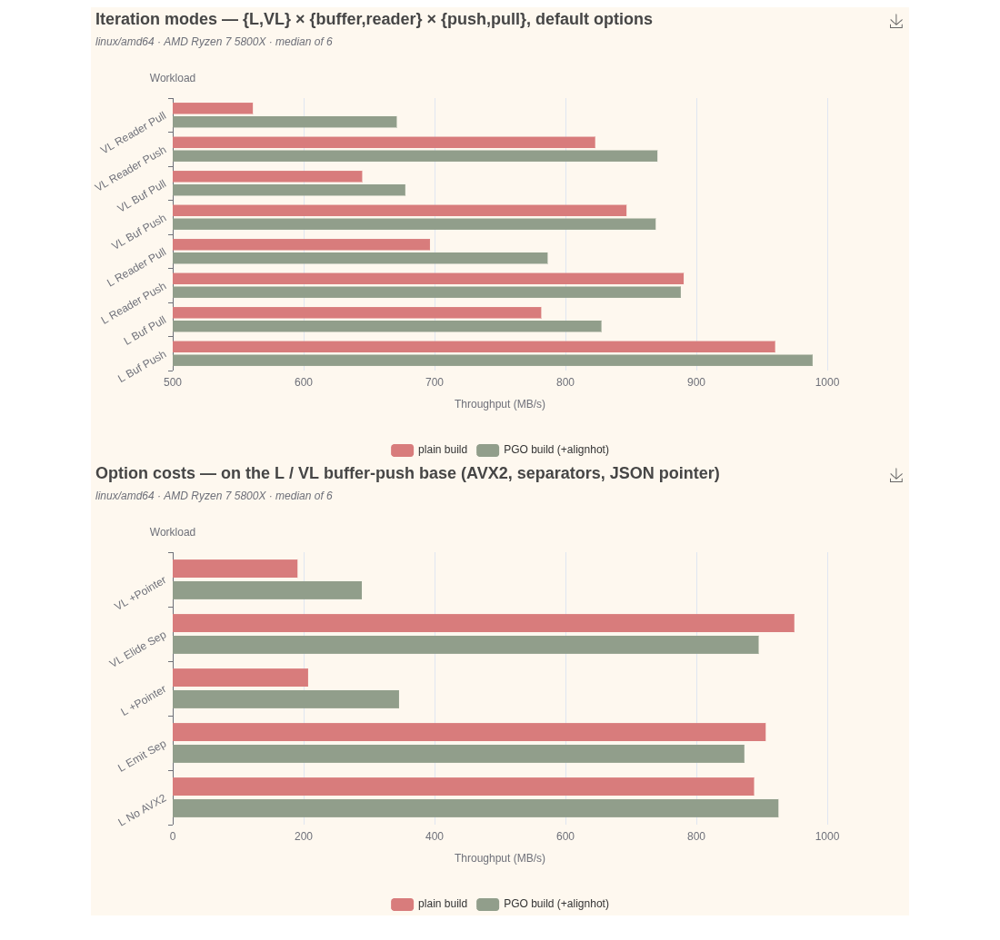

# Azure-lanes chart (benchviz)

A companion to the [main throughput chart](../README.md). Where that one compares the
lexer against external tokenizers across many payloads, this one holds **one payload**
fixed — the merged go-openapi/**azure** OpenAPI spec — and fans out across **every
variant and option lane of the default lexer**, each built two ways: a **plain** build
and a **PGO** build (profile-guided, with hot-loop alignment). So this chart answers a
different question: *what does each knob cost, and how much does PGO buy, on a
representative real payload?*

Restricting to one payload is deliberate — the lane matrix is large, and holding the
payload fixed isolates the lane / option / PGO effect from workload variance. Azure is
chosen because its long-description / short-key shape exercises every path that matters
(the AVX2 long-string scan, the whitespace skip, object keys, structure).



## What you are looking at

Two stacked charts, **one row per lane**, **two bars per row**: the same binary built
**plain** (red) and with **PGO + `-d=alignhot`** (green). Longer is faster; the numbers
are the **median of 6 runs** on an AMD Ryzen 7 5800X (`linux/amd64`). Each lane drains
the whole document to EOF; `b.SetBytes` is the input size, so bars are *input*
throughput. Note the top chart's x-axis auto-scales from ~500 MB/s (it amplifies the
gaps) while the options chart starts at 0 — read absolute values off the axis.

- **Iteration modes** — the 8-way matrix `{L, VL} × {buffer, reader} × {push, pull}` at
  default options. The ordering you can read off it:
  - **buffer > reader** — the whole-buffer champion path (zero-copy, no refill) beats the
    streaming lane; the gap widens for the pull lanes.
  - **push ≳ pull** — the range-over-func push core edges the `NextToken` loop.
  - **L > VL** — the verbatim lexer does strictly more work (keeps raw values, tracks
    blanks + line/column), the honest cost of round-trippability.
  - Champion **L buffer/push ≈ 960 MB/s** plain, the fastest lane.
- **Option costs** — each knob toggled on the L / VL buffer-push base:
  - **AVX2** (`L no-AVX2` vs `L buf push`): the AVX2 long-string gate is worth **~8%**
    here (888 → 960) — azure's long descriptions are exactly what it accelerates.
  - **Separators**: eliding is cheaper — `VL elide-sep` (950) is **~12% faster** than the
    verbatim default `VL buf push` (847), because the consumer walks fewer tokens; the
    mirror `L emit-sep` (906) is slower than eliding `L buf push` (960).
  - **JSON pointer** (`+pointer`): tracking the pointer **forfeits zero-alloc** (it
    interns every object key and grows a path stack), so throughput drops to **~200 MB/s**
    with ~13.6k allocs/doc — a ~4.6× cost, the documented opt-in price. It is the only
    knob that changes the allocation profile.

## The PGO story

PGO's uplift here is **modest and lane-dependent**, and that is the point:

- On the **AVX2-bound champion** (`L buf push`) PGO adds only **~3%** (960 → 989). Azure
  is string-heavy, so the hot loop is the vectorized string scan, not the small scalar
  loops that PGO's `PCALIGN` most benefits — see the [lexer README "Performance and
  PGO"](../../../default-lexer/README.md#performance-and-pgo). (On number-dense payloads
  like `numbers`/`mesh` the champion's PGO win is much larger; that is a different chart.)
- The uplift is **bigger where scalar work dominates**: the streaming pull lanes gain
  more (`VL reader pull` 561 → 671, **+20%**; `L reader pull` 697 → 786, **+13%**).
- It is **dramatic on the alloc-heavy `+pointer` lanes** (`L +pointer` 207 → 346, **+67%**;
  `VL +pointer` 191 → 289, **+52%**) — PGO inlines the hot intern/append call chains the
  pointer path leans on.
- A couple of lanes land **within noise** of plain, even marginally below (`L emit-sep`,
  `VL elide-sep`). That is expected: on a string-bound payload PGO's alignment lever has
  little to grab, and median-of-6 still carries run variance. It is reported honestly
  rather than cherry-picked.

**Takeaway:** build with PGO for production (it never hurts and sometimes helps a lot),
but do not expect a uniform speedup — the win concentrates where hot scalar loops and hot
call chains dominate, not on the already-vectorized string path.

## Files

| file             | role                                                                 |
|------------------|----------------------------------------------------------------------|
| `azure_lanes.yaml` | chart config: 1 metric (MB/s) × 13 lanes (contexts) × 2 builds (versions), in 2 categories |
| `benchmark.txt`  | input data: median-of-6, tagged `/base/` vs `/pgo/`, one line per lane |
| `azure_lanes.png`| rendered output (theme: `vintage`)                                   |
| `regen.sh`       | reproducible pipeline: plain run + profile + PGO run + median-collapse |
| `median.awk`     | collapse helper: picks the median-MB/s run line, injects the version tag |

## Regenerate

```sh
# from the benchmark module root — runs both builds and rebuilds benchmark.txt:
./benchviz/azure_lanes/regen.sh          # ~4 min (2× 6 runs + a PGO rebuild)

# then render (from this directory):
benchviz -c azure_lanes.yaml -png -o azure_lanes.png benchmark.txt
```

The PGO build uses `-pgo=azure.pgo -gcflags=all=-d=alignhot=32`; the profile is
self-collected from the same benchmark. `benchviz -c azure_lanes.yaml -r benchmark.txt`
prints an ingestion report (no render) to check every lane is matched.

> PNG rendering needs a local Chrome/chromedp and network for the go-echarts CDN. In a
> sandboxed browser, render the HTML (`-o azure_lanes.html`), inline the two echarts
> `<script src>` assets, and screenshot the self-contained page with
> `chromium --headless --screenshot --window-size=1100,1035` (see the main chart's
> README for the fallback recipe).
